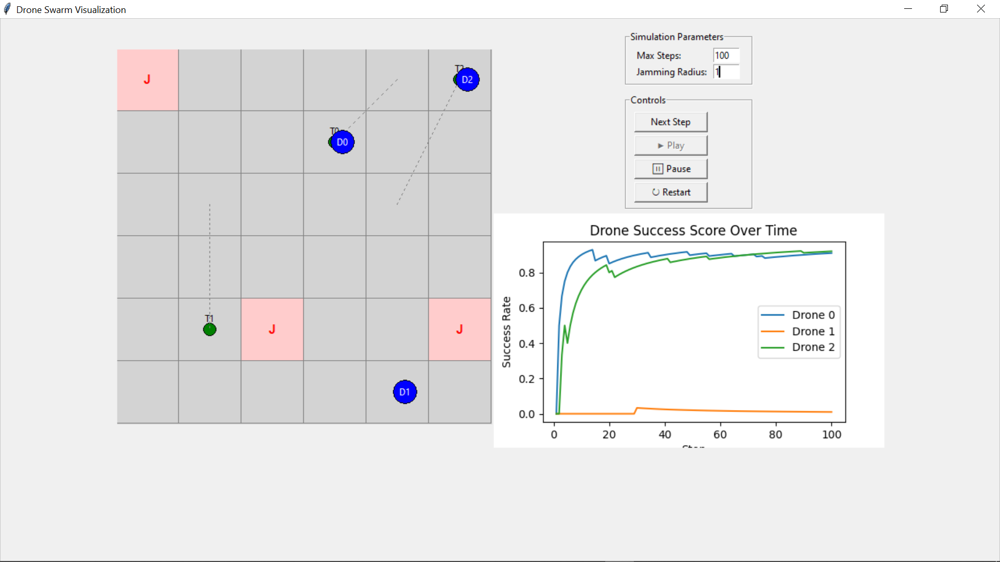

# 🚁 Drone Swarm Simulation with Jamming Zones and Real-Time GUI

This project simulates a swarm of drones navigating a grid environment while avoiding jamming zones. It features a real-time Tkinter-based GUI, drone animation, pathfinding (BFS), and video export functionality.

---

## 📌 Features

- 👾 **Autonomous drones** trying to reach targets
- 🚫 **Jamming zones** that probabilistically jam drones nearby
- 🧠 **BFS pathfinding** to avoid jamming areas (for smarter drones)
- 📊 **Real-time GUI** with Tkinter and Matplotlib
- 🎥 **Video export** of the drone simulation using OpenCV
- 📈 **Live graph** tracking each drone's success rate over time

---

## 🎥 Demo



Watch the simulation video:
[▶️ Click here to watch](https://youtu.be/_WEqW5wRX18)

---

## 🖥️ GUI Preview

The GUI displays:
- Grid with drones and targets
- Jamming zones (red marked cells)
- Real-time drone movement and jam feedback
- Score graph of drone success rate

---

## 🛠️ Requirements

Install dependencies with:

```bash
pip install -r requirements.txt
